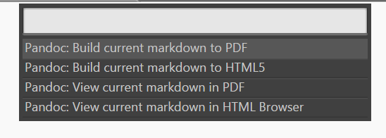

% PhpConnector 主题情报

主人，你好，小 P 插件已经为您搭载完毕，如果首次启动，请仔细阅读下面的[环境搭载](#环境搭载)，老鸟可直接跳过。

关于作者：

<iframe width="100%" height="550" class="share_self"  frameborder="0" scrolling="no" src="http://widget.weibo.com/weiboshow/index.php?language=&width=0&height=550&fansRow=2&ptype=1&speed=50&skin=1&isTitle=1&noborder=1&isWeibo=1&isFans=0&uid=2913855812&verifier=5375064e&dpc=1"></iframe>

# 搭载

PhpConnector 的使用非常简单，您可以回到您刚刚打开的 Sublime 中，此时我已经为您打开了 PhpConnector 的 官方 readme.md 文件。

这是一个 Markdown 文档文件，您可以把你的左手放在键盘上，使用当前机能正常的手指锁定 `Ctrl + Shift + r` 三个键 --> 按下！于是美好的事情发生了：

在这里，选择 `Pandoc:View current Markdown in Html Browser` 即可在浏览器中看到 readme.md 的 HTML 输出结果。包括本文档 亦是由 本插件中的 Markdown 编译脚本生成出来的哟~~。

# 操作

本插件所占用的唯一快捷键仅是：`ctrl+shift+r`。这个快捷键的效果与 sublime 原生自带的 `ctrl+shift+p` 类似，只不过列出在这里的命令都是完全采用 PHP 开发的命令插件。

当然，Sublime 支持 默认快捷键的用户配置文件覆盖与重写。

# 历史

由于作者目前仅有一人在奋斗，且是 python 小白（否则也不会想用 PHP 开发插件啦），所以插件系统版本迭代较慢，下面是几个重要历史回忆：

* v0.1.0：创生

	* 支持 与 PHP 建立通信，可通过 PHP 来简单输出到 Sublime。

* v2.0：骨架

	* 加入 OOP Sublime 插件开发接口框架
	* 提供 官方示例 PHP 脚本
	* 示例脚本嵌入 Pandoc 转换至 PDF、Html 的编译脚本。

* v2.5：待命

    * 加入 多语言支持
    * 加入 文件系统编码支持
    * 新增 `php_path` 和 `filesystem encoding` 两项的可视化配置向导程序。
    * 修复 Sublime 3 跨平台支持。
    * 提供 优化的 PHP 错误异常捕获机制。
    * 开始嗨皮地使用 PHP 来开发 Sublime 插件吧 ^_^

# 插入

本插件目前已支持直接通过 PHP 命名空间方式，来支援开发者基于 PhpConnector 直接开发 Sublime 插件。对于 Sublime 2 和3 与 Python 版本之间的跨平台性，PhpConnector 2.5 开始已在底层提供了原生的支持，开发者只需维护一套自己的脚本，即可直接插入到跨版本跨平台 Sublime 设备中。

相关示例代码已在原生插件中有提供，及 NameSpace 如何插入，命令列表 `Chigi.phpconnector-commands` 示例均在 插件的 `sublime_php_command` 目录下。

开发者自己开发的扩展可随意放置在自己 PC 的任意路径下，最后直接在 Sublime 中配置上 Namespace 的关联路径即可。

# 协议

The plugin is licensed under the MIT license.

Copyright (C) <2014> Richard Lea <chigix@zoho.com>

Permission is hereby granted, free of charge, to any person obtaining a copy of this software and associated documentation files (the "Software"), to deal in the Software without restriction, including without limitation the rights to use, copy, modify, merge, publish, distribute, sublicense, and/or sell copies of the Software, and to permit persons to whom the Software is furnished to do so, subject to the following conditions:

The above copyright notice and this permission notice shall be included in all copies or substantial portions of the Software.

THE SOFTWARE IS PROVIDED "AS IS", WITHOUT WARRANTY OF ANY KIND, EXPRESS OR IMPLIED, INCLUDING BUT NOT LIMITED TO THE WARRANTIES OF MERCHANTABILITY, FITNESS FOR A PARTICULAR PURPOSE AND NONINFRINGEMENT. IN NO EVENT SHALL THE AUTHORS OR COPYRIGHT HOLDERS BE LIABLE FOR ANY CLAIM, DAMAGES OR OTHER LIABILITY, WHETHER IN AN ACTION OF CONTRACT, TORT OR OTHERWISE, ARISING FROM, OUT OF OR IN CONNECTION WITH THE SOFTWARE OR THE USE OR OTHER DEALINGS IN THE SOFTWARE.
